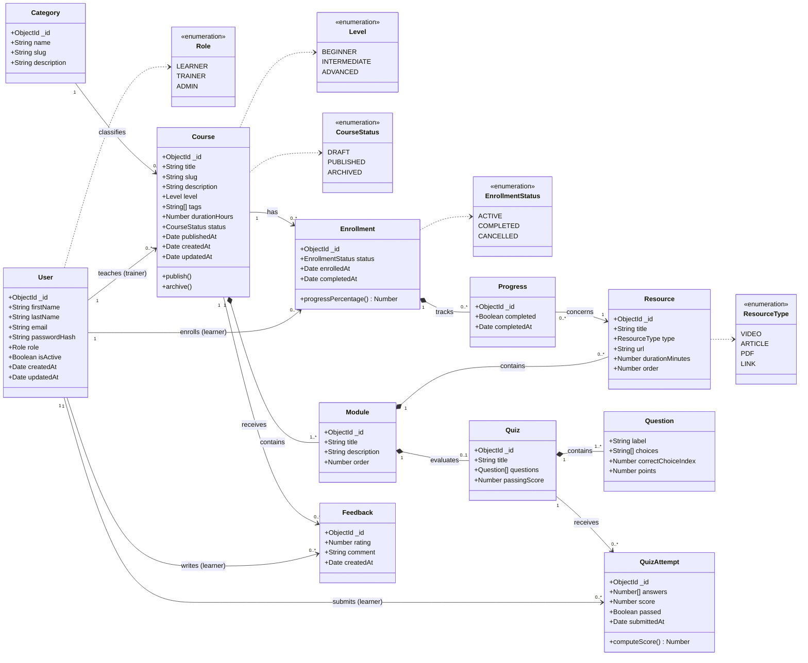

# Class diagram

Global domain model of the LMS. Phase 1 implements `Course`, `Module`, `Resource` (and the bonus `Category`); the other classes are designed now so that Phases 2 and 3 extend the model without breaking it.

## Notes

- **Composition** (`*--`): a `Module` cannot exist without its `Course`, a `Resource` or a `Quiz` without its `Module`; deleting the parent deletes the children.
- **Association** (`-->`): `Enrollment`, `QuizAttempt` and `Feedback` reference a `User` with role `learner`; `Course.trainer` references a `User` with role `trainer`.
- Uniqueness constraints: `User.email`, `Category.name`, `Course.slug`, (`Module.course`, `Module.order`), (`Enrollment.learner`, `Enrollment.course`), (`Feedback.learner`, `Feedback.course`).
- In MongoDB, the child side stores the reference (`Module.course`, `Resource.module`, ...), which keeps documents small and lets each collection be queried independently.
