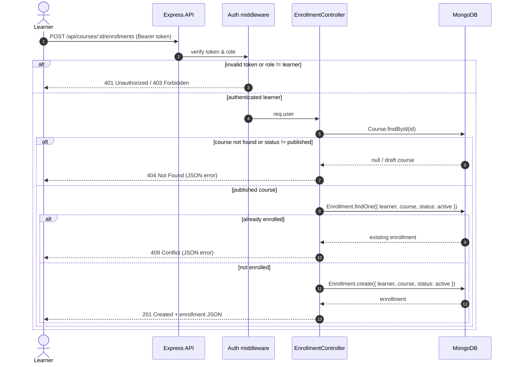

# Complementary diagram: course enrollment sequence

## Why this diagram secures the sprint

Enrollment is the pivot between the public catalog delivered in Phase 1 and the authenticated learning journey of Phases 2 and 3: it is the first flow that combines authentication, role checks, catalog business rules (BR-09, BR-10) and the error contract. Modelling it now validates that the Phase 1 models and the centralized JSON error handling (`404`, `409`, ...) already support the next sprint, and gives the team an unambiguous contract to implement in parallel without rework.
