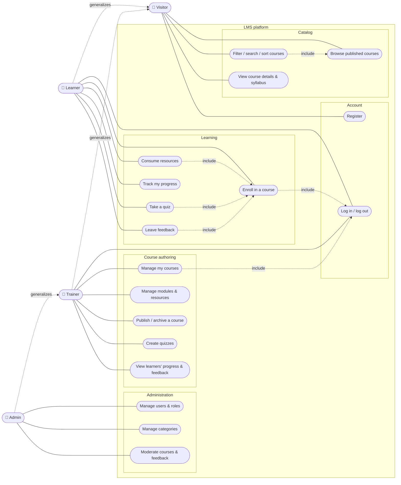

# Use case diagram

Mermaid has no native UML use case notation, so the diagram uses a flowchart: actors are on the sides, use cases are the rounded nodes inside the system boundary. Role inheritance follows UML generalization: a **Learner** and a **Trainer** can do everything a **Visitor** can, and an **Admin** can do everything a **Trainer** can.

## Use cases per role

| Role | Use cases | Phase |
| ---- | --------- | ----- |
| Visitor | UC1, UC2, UC3 (catalog), UC4 | 1 (catalog), 2 |
| Learner | UC5, UC6, UC7, UC8, UC9, UC10 | 2-3 |
| Trainer | UC5, UC11, UC12, UC13, UC14, UC15 | 2-3 |
| Admin | UC16, UC17, UC18 (+ all trainer use cases on any course) | 2-3 |
